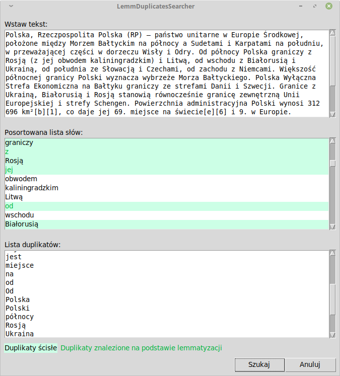

# LemmDuplicatesSearcher

Program dzieli tekst na tokeny, wykorzystując bibliotekę `NLTK`, następnie dokonuje analizy morfologicznej za pomocą `Morfeusz2`. Zwraca listę zduplikowanych słów. Podczas szukania duplikatów bierze pod uwagę formy podstawowe słów. Np. jako duplikaty traktuje słowa *mieć* i *ma*.

Wymaga:
- Python 3.6+
- NLTK
- Morfeusz2 4.0
